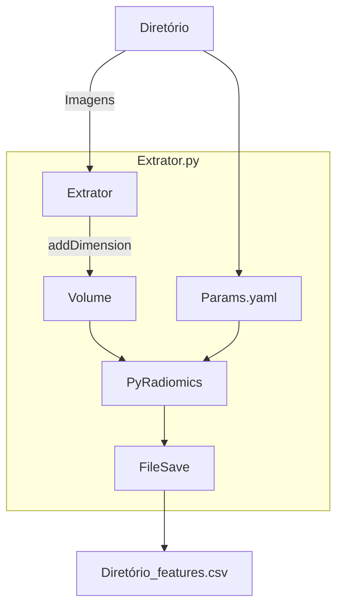

# PyRadiomicsExtraction

Execução via terminal:

> **python {{{extrator}}} {{{/diretório_com_imagens}}} {{{parametros}}}**

O arquivo resultante por padrão estará no formato .CSV, e será salvo no diretório onde o extrator for executado, com padrão de nome: 

> {{{/diretório_com_imagens}}}_features.csv

### Funcionamento:

## Dependências:

- six
- gc
- radiomics
- numpy
- pandas
- SimpleITK

### Dependências específicas:

v2.0 e anteriores - Sem dependências específicas.

v2.1 - Necessária a criação de diretório ***C:/ResultsFromPyrad/*** para armazenamento dos arquivos .nrrd com as características extraídas.

v2.2 e posteriores - Sem dependências específicas.
