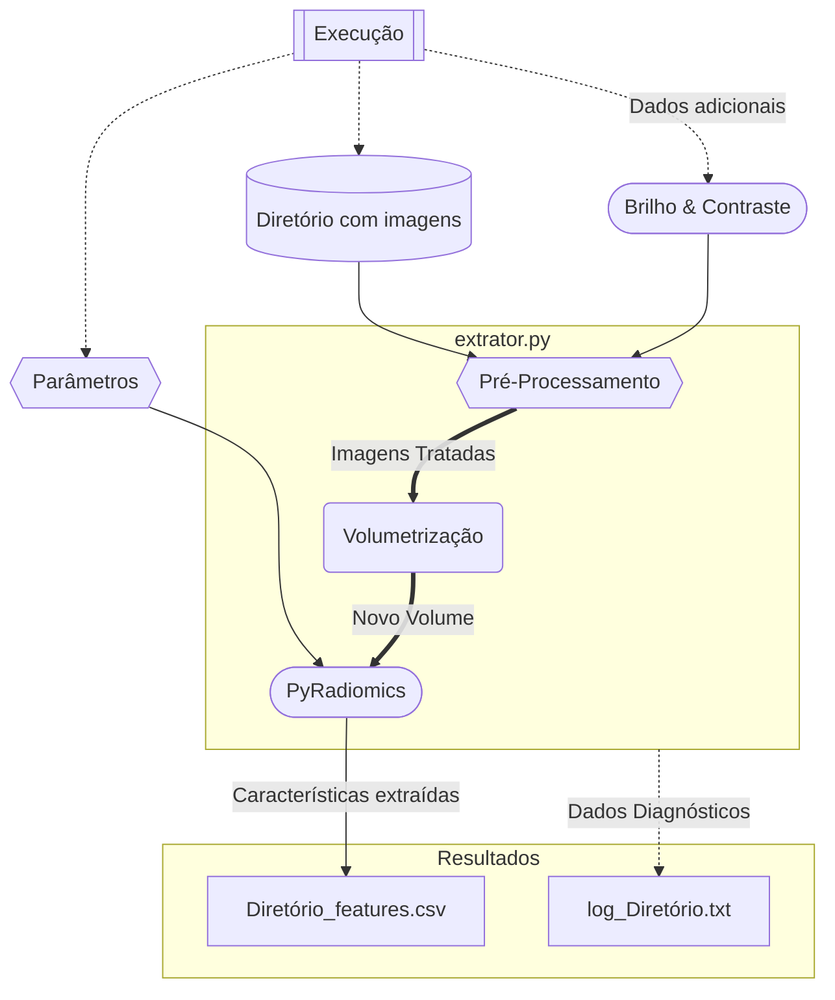

# PyRadiomicsExtraction

## Sumário:

- [Execução](https://github.com/OctavioFurio/PyRadiomicsExtraction#execu%C3%A7%C3%A3o)
- [Funcionamento](https://github.com/OctavioFurio/PyRadiomicsExtraction#funcionamento)
- [Pré-Processamento](https://github.com/OctavioFurio/PyRadiomicsExtraction#pr%C3%A9-processamento)
- [Dependências](https://github.com/OctavioFurio/PyRadiomicsExtraction#depend%C3%AAncias)

### Execução:

Execução via terminal:

    python {{{extrator}}} {{{/diretório_com_imagens}}} {{{parametros}}} (Brilho) (Contraste)
    
*Parâmetros entre parênteses são opcionais, com valores padrão 0 (sem efeitos).

O arquivo resultante por padrão estará no formato .CSV, e será salvo no diretório onde o extrator for executado, com padrão de nome: 

> {{{/diretório_com_imagens}}}_features.csv

Um arquivo adicional será criado, contendo algumas informações adicionais a respeito da extração, com padrão de nome:

> Log_{{{/diretório_com_imagens}}}.txt

### Funcionamento:

### Pré-processamento

É possível, se necessário, alterar significativamente o Brilho e Contraste das imagens, registrando-se no ato da execução os valores a serem utilizados pelo programa.
É recomendado que estejam no intervalo [-100, 100], para evitar um comportamento destrutivo do pré-processamento nas imagens.

    python {{{extrator}}} {{{/diretório_com_imagens}}} {{{parametros}}} (Brilho) (Contraste)

O ajuste desses parâmetros alterará **todas** as imagens do diretório durante a extração.
Recomenda-se a alteração destes parâmetros vide testes com as imagens.

Seguem imagens com diferentes níveis de cada parâmetro:

|  Parâmetro  |     -100     |     -50     |     0     |     50     | 100         |
|:------:|:------------:|:-----------:|:---------:|:----------:|-------------|
| Brilho |  |  |  |  |  |

|  Parâmetro |       0      |      50     |    100    |
|:---------:|:------------:|:-----------:|:---------:|
| Contraste |  |  |  |

### Dependências:

- datetime
- gc
- numpy
- OpenCV
- pandas
- radiomics
- SimpleITK
- six
- timeit
